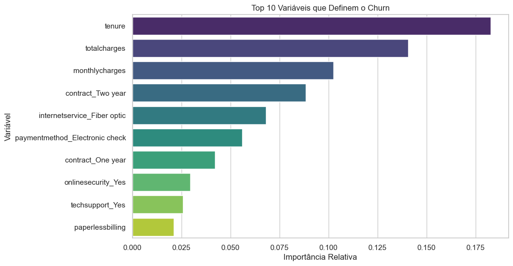
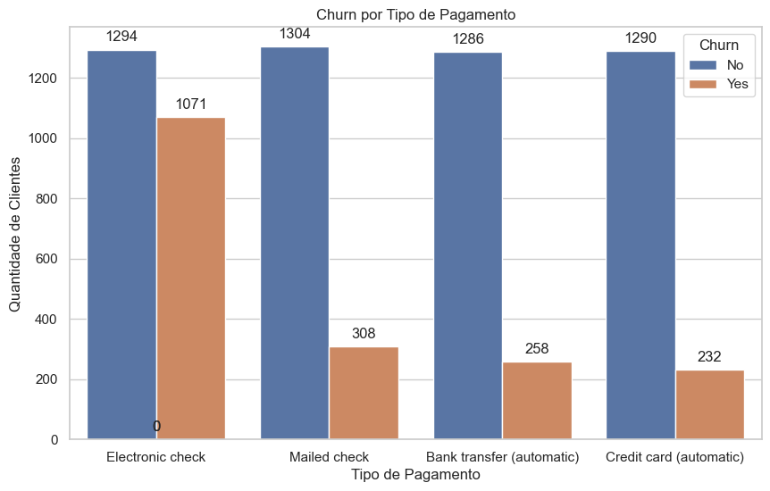
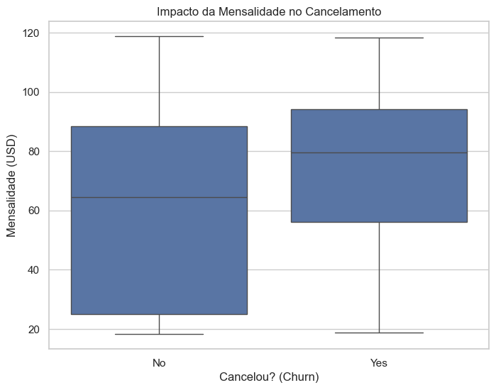

# 📊 Telco Churn Analysis & Prediction


## 🎯 Objetivo do Projeto
Identificar os principais fatores que levam ao cancelamento de clientes (Churn) e construir um modelo preditivo para identificar clientes em risco.
**Business Case:** Reduzir o churn identificando perfis de risco e sugerindo ações preventivas.

## 🛠️ Tecnologias Utilizadas
* **Linguagem:** Python
* **Bibliotecas:** Pandas, Seaborn, Scikit-Learn (Random Forest)
* **Ambiente:** Jupyter Notebook

## 💡 Principais Insights (Data Storytelling)
1.  **Risco Inicial:** O fator determinante para o churn é o `tenure`. Clientes novos (< 6 meses) são os mais voláteis.
    <p align="center">
      
    </p>

2.  **O Vilão do Pagamento:** O método "Electronic Check" tem taxa de cancelamento significativamente maior que Cartão de Crédito.
    <p align="center">
      
    </p>

3.  **Sensibilidade ao Preço:** Clientes com mensalidades mais altas tendem a cancelar mais (Churn de Receita).
    <p align="center">
      
    </p>

## 🤖 Performance do Modelo
O modelo Random Forest alcançou um **Recall de 71%** para a classe de Churn.
* Isso significa que o modelo é capaz de detectar **7 de cada 10** clientes que realmente cancelariam, permitindo ação preventiva da equipe de retenção.

## 🚀 Como Rodar o Projeto
1. Clone o repositório:
   ```bash
   git clone https://github.com/marcosbaccin/churn-analysis-storytelling.git
2. Instale as dependências:
    ```bash
    pip install -r requirements.txt
3. Execute o notebook:
    ```bash
    jupyter lab notebooks/01_eda_inicial.ipynb

## ✒️ Autor
Marcos Baccin - https://www.linkedin.com/in/marcosbaccin/
